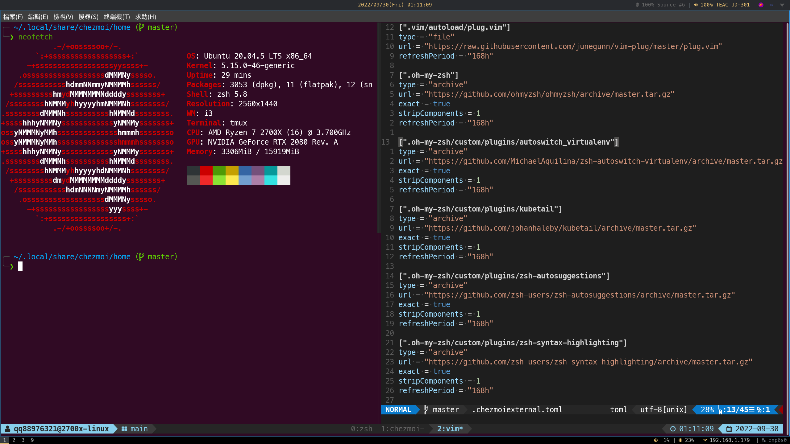

# Dotfiles <!-- omit in toc -->


My linux dotfiles and daily used tools, managed with [chezmoi](https://www.chezmoi.io). Mainly used on Ubuntu 20.04 Desktop / Server and seldomly used on Ubuntu 20.04 / 22.04 WSL. (The installation scripts for some tools are currently not supported on Ubuntu 18.04.)

## Table of Contents <!-- omit in toc -->

- [Preface](#preface)
- [Installation](#installation)
- [Font](#font)
- [Key Bindings](#key-bindings)
    - [i3](#i3)
    - [tmux](#tmux)
        - [tmux-copycat](#tmux-copycat)
        - [tmux-yank](#tmux-yank)
            - [Normal Mode](#normal-mode)
            - [Copy Mode](#copy-mode)
        - [Tmux Plugin Manager](#tmux-plugin-manager)
    - [tig](#tig)
        - [Generic bindings](#generic-bindings)
        - [Main bindings](#main-bindings)
    - [vim](#vim)

## Preface

i3, polybar, gnome terminal, tmux, zsh and vim



## Installation

**NOTE**: These dotfiles and tools are customized according to personal preferences and development needs. Therefore, you are advised to review the code and remove what you don't want or need (especially the scripts in the `.chezmoiscripts` folder).

Install the `chezmoi` command and dotfiles from this GitHub dotfile repo on a new machine with this command:

```sh
# Option 1: installed by curl
$ sh -c "$(curl -fsLS https://chezmoi.io/get)" -- init --apply qq88976321
# Option 2: installed by wget
$ sh -c "$(wget -qO- https://chezmoi.io/get)" -- init --apply qq88976321

# And then fill in prompts or just leave it empty if you don't need it
# The config file, typically ~/.config/chezmoi/chezmoi.toml, is specific to the local machine.
# [GUI] Does this machine need desktop environment and applications (y/n)?
# [Git] Username?
# [Git] Email address?
# [Git] GnuPG signature key?
# [Git] Private git repository?
```

## Font

Please take a look at [Meslo Nerd Font patched for Powerlevel10k](https://github.com/romkatv/powerlevel10k/blob/master/font.md).

## Key Bindings

Here are my daily used key bindings, which may not include all the key bindings supported by these tools.

### [i3](https://github.com/i3/i3)

| key                                     | description                                  |
| --------------------------------------- | -------------------------------------------- |
| `win` (Mod4)                            | modifier                                     |
| $mod+`enter`                            | open terminal                                |
| $mod+`shift`+`q`                        | close focused window                         |
| $mod+`d`                                | open rofi                                    |
| $mod+`h` / $mod+`Left`                  | focus left                                   |
| $mod+`j` / $mod+`Down`                  | focus down                                   |
| $mod+`k` / $mod+`Up`                    | focus up                                     |
| $mod+`l` / $mod+`Right`                 | focus right                                  |
| $mod+`shift`+`h` / $mod+`shift`+`Left`  | move focused window left                     |
| $mod+`shift`+`j` / $mod+`shift`+`Down`  | move focused window down                     |
| $mod+`shift`+`k` / $mod+`shift`+`Up`    | move focused window up                       |
| $mod+`shift`+`l` / $mod+`shift`+`Right` | move focused window right                    |
| $mod+`shift`+`space`                    | toggle tiling / floating                     |
| $mod+<0 to 9>                           | switch to workspace <0 to 9>                 |
| $mod+`shift`+<0 to 9>                   | move focused container to workspace <0 to 9> |
| $mod+`shift`+`c`                        | reload the configuration file                |
| $mod+`shift`+`r`                        | restart i3 inplace                           |
| $mod+`shift`+`e`                        | exit i3                                      |
| $mod+`ctrl`+`l`                         | lock screen using i3lock-fancy               |
| $mod+`r`                                | enter resize mode                            |
| $mod+`mouse right click`                | resize window                                |

### [tmux](https://github.com/tmux/tmux)

First press the prefix key `ctrl`+`space`, released and then press the key listed below.

| key       | description                 |
| --------- | --------------------------- |
| `?`       | list all key bindings       |
| `|`       | split window horizontally   |
| `-`       | split window vertically     |
| `<arrow>` | select pane                 |
| `p`       | previous window             |
| `n`       | next window                 |
| `c`       | create a new window         |
| `,`       | rename current window       |
| `&`       | kill current window         |
| `w`       | choose a window from a list |
| `R`       | source .tmux.conf           |

#### [tmux-copycat](https://github.com/tmux-plugins/tmux-copycat)

First press the prefix key `ctrl`+`space`, released and then press the key listed below.

| key        | description                                                         |
| ---------- | ------------------------------------------------------------------- |
| `ctrl`+`f` | simple file search                                                  |
| `ctrl`+`g` | jumping over git status files (best used after git status command)  |
| `alt`+`h`  | jumping over SHA-1/SHA-256 hashes (best used after git log command) |
| `ctrl`+`u` | url search (http, ftp and git urls)                                 |
| `ctrl`+`d` | number search (mnemonic d, as digit)                                |

#### [tmux-yank](https://github.com/tmux-plugins/tmux-yank)

##### Normal Mode

First press the prefix key `ctrl`+`space`, released and then press the key listed below.

| key | description                                                        |
| --- | ------------------------------------------------------------------ |
| `y` | copies text from the command line to the clipboard                 |
| `Y` | copy the current pane's current working directory to the clipboard |

##### Copy Mode

| key | description                                                          |
| --- | -------------------------------------------------------------------- |
| `y` | copy selection to system clipboard                                   |
| `Y` | copy selection to system clipboard, and paste it to the command line |

#### [Tmux Plugin Manager](https://github.com/tmux-plugins/tpm)

First press the prefix key `ctrl`+`space`, released and then press the key listed below.

| key       | description                                                                                 |
| --------- | ------------------------------------------------------------------------------------------- |
| `I`       | installs new plugins from GitHub or any other git repository and refreshes TMUX environment |
| `U`       | updates plugin(s)                                                                           |
| `alt`+`u` | remove/uninstall plugins not on the plugin list                                             |

### [tig](https://github.com/jonas/tig)

#### Generic bindings

| key | description                  |
| --- | ---------------------------- |
| `c` | copy commit id to clipboard |

#### Main bindings

| key | description                    |
| --- | ------------------------------ |
| `R` | start git rebase at the commit |
| `F` | fixup the commit               |
| `C` | cherry-pick this commit        |

### vim

TODO: still have a lot to learn
